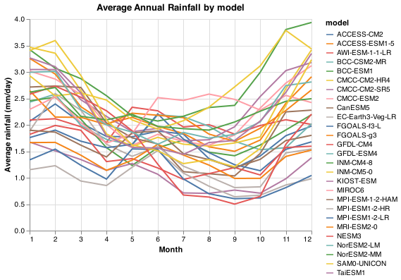

# Predicting rainfall with lots of data

We will implement and deploy a machine learning model using Flask to predict rainfall levels over New South Wales, Australia, using historical data.
The challenge of this project is that the [dataset](https://figshare.com/articles/dataset/Daily_rainfall_over_NSW_Australia/14096681) is large so the model cannot be run on our local laptops. We don't yet know how to do this yet, this repo is where it will all come together. The figure below provides a snapshot of the data we will be working with, rainfall measurements have been averaged by month to produce an annual rainfall trend.

  

# Loading Data and EDA

[This notebook](https://github.com/UBC-MDS/525_group17/blob/main/notebooks/Milestone1.ipynb) contains code to load and combine data. Simple EDA has been performed on the dataset in Python and R to better understand the data we are working with.

# Contributors
This project was created by DSCI 525 Group 17:

- Lara Habashi
- Cameron Harris
- Trevor Kinsey
- Guanshu Tao
